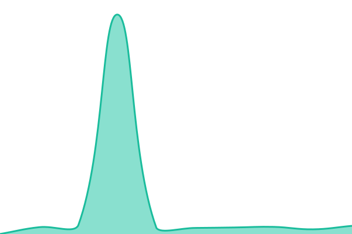

# [📈 Live Status](https://status.enok.techfivex.pt): <!--live status--> **🟧 Partial outage**

This repository contains the open-source uptime monitor and status page for [Vanilson Pires](https://status.enok.techfivex.pt), powered by [Upptime](https://github.com/upptime/upptime).

With [Upptime](https://upptime.js.org), you can get your own unlimited and free uptime monitor and status page, powered entirely by a GitHub repository. We use [Issues](https://github.com/vanilsonpires/enok-status/issues) as incident reports, [Actions](https://github.com/vanilsonpires/enok-status/actions) as uptime monitors, and [Pages](https://status.enok.techfivex.pt) for the status page.

<!--start: status pages-->
<!-- This summary is generated by Upptime (https://github.com/upptime/upptime) -->
<!-- Do not edit this manually, your changes will be overwritten -->
<!-- prettier-ignore -->
| URL | Status | History | Response Time | Uptime |
| --- | ------ | ------- | ------------- | ------ |
|  [Webpages](https://enok.techfivex.pt/) | 🟩 Up | [webpages.yml](https://github.com/vanilsonpires/enok-status/commits/HEAD/history/webpages.yml) | 

 1874ms
     
 | 

<a href="https://status.enok.techfivex.pt/history/webpages">100.00%</a>
    

|  [Gateway Service](https://enok.techfivex.pt/api/actuator/health) | 🟩 Up | [gateway-service.yml](https://github.com/vanilsonpires/enok-status/commits/HEAD/history/gateway-service.yml) | 

 1151ms
     
 | 

<a href="https://status.enok.techfivex.pt/history/gateway-service">100.00%</a>
    

|  [Account Service](https://account.techfivex.pt/) | 🟩 Up | [account-service.yml](https://github.com/vanilsonpires/enok-status/commits/HEAD/history/account-service.yml) | 

 2853ms
     
 | 

<a href="https://status.enok.techfivex.pt/history/account-service">97.10%</a>
    

|  [Notification Service](https://sync.techfivex.pt/) | 🟥 Down | [notification-service.yml](https://github.com/vanilsonpires/enok-status/commits/HEAD/history/notification-service.yml) | 

 564ms
     
 | 

<a href="https://status.enok.techfivex.pt/history/notification-service">0.00%</a>
    

|  [Enok Service](https://enok.techfivex.pt/api/enok-service/actuator/health) | 🟩 Up | [enok-service.yml](https://github.com/vanilsonpires/enok-status/commits/HEAD/history/enok-service.yml) | 

 1403ms
     
 | 

<a href="https://status.enok.techfivex.pt/history/enok-service">95.51%</a>
    

|  [Chat Service](https://enok.techfivex.pt/api/chat-service/actuator/health) | 🟩 Up | [chat-service.yml](https://github.com/vanilsonpires/enok-status/commits/HEAD/history/chat-service.yml) | 

 1297ms
     
 | 

<a href="https://status.enok.techfivex.pt/history/chat-service">95.69%</a>
    

|  [CRM Service](https://enok.techfivex.pt/api/crm-service/actuator/health) | 🟩 Up | [crm-service.yml](https://github.com/vanilsonpires/enok-status/commits/HEAD/history/crm-service.yml) | 

 5841ms
     
 | 

<a href="https://status.enok.techfivex.pt/history/crm-service">97.31%</a>
    

|  [Contract Service](https://enok.techfivex.pt/api/contract-service/actuator/health) | 🟩 Up | [contract-service.yml](https://github.com/vanilsonpires/enok-status/commits/HEAD/history/contract-service.yml) | 

 1199ms
     
 | 

<a href="https://status.enok.techfivex.pt/history/contract-service">97.39%</a>
    

|  [Integration Service](https://enok.techfivex.pt/api/integration-service/actuator/health) | 🟩 Up | [integration-service.yml](https://github.com/vanilsonpires/enok-status/commits/HEAD/history/integration-service.yml) | 

 1285ms
     
 | 

<a href="https://status.enok.techfivex.pt/history/integration-service">95.90%</a>
    

|  [Inventory Service](https://enok.techfivex.pt/api/inventory-service/actuator/health) | 🟩 Up | [inventory-service.yml](https://github.com/vanilsonpires/enok-status/commits/HEAD/history/inventory-service.yml) | 

 784ms
     
 | 

<a href="https://status.enok.techfivex.pt/history/inventory-service">97.58%</a>
    

|  [Sales Service](https://enok.techfivex.pt/api/sales-service/actuator/health) | 🟩 Up | [sales-service.yml](https://github.com/vanilsonpires/enok-status/commits/HEAD/history/sales-service.yml) | 

 599ms
     
 | 

<a href="https://status.enok.techfivex.pt/history/sales-service">97.67%</a>
    

<!--end: status pages-->

[**Visit our status website →**](https://status.enok.techfivex.pt)

## 📄 License

- Powered by: [Upptime](https://github.com/upptime/upptime)
- Code: [MIT](./LICENSE) © [Anand Chowdhary](https://anandchowdhary.com)
- Data in the `./history` directory: [Open Database License](https://opendatacommons.org/licenses/odbl/1-0/)
